# 🧵 Zubair Tailors Management System

A comprehensive, offline-first shop management system designed for tailoring businesses. This repository contains the source code for the **Zubair Tailors Mobile App** (built using Flutter), administrative tools for license generation, and development briefs for future native Android migration.

---

## 📂 Repository Structure

The repository is organized as follows:

*   **[`mobile_app/`](file:///e:/Zubair%20Tailors/mobile_app)**: The primary mobile application built with Flutter (Material 3). It supports customer management, measurements tracking (with historic logs), order status tracking, custom PDF invoicing, offline-first SQLite storage, Google Drive sync, and bilingual localization (English / Urdu).
*   **[`kotlin_app_prompt.md`](file:///e:/Zubair%20Tailors/kotlin_app_prompt.md)**: A complete, structured system specification and development brief detailing all requirements, schemas, and logic for migrating the Flutter app to a native Kotlin Android application (using Jetpack Compose, Room, DataStore, and AlarmManager).

---

## 📱 Application Screenshots / Screen Showcases

### 📊 Main Dashboard
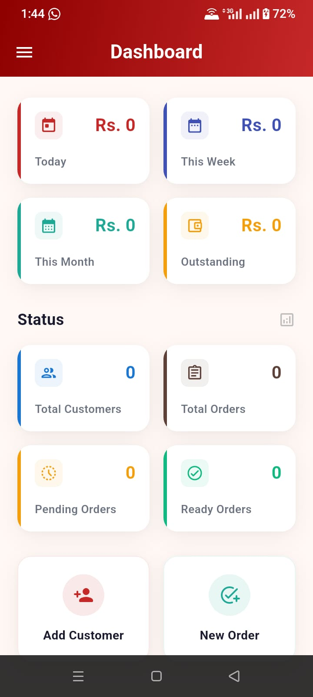

### 👥 Customer Directory & Management
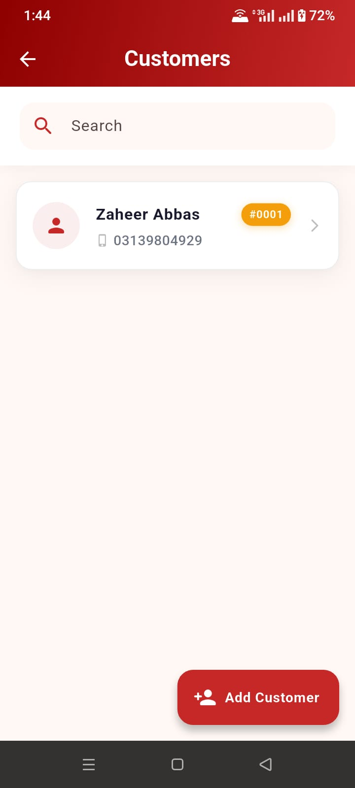
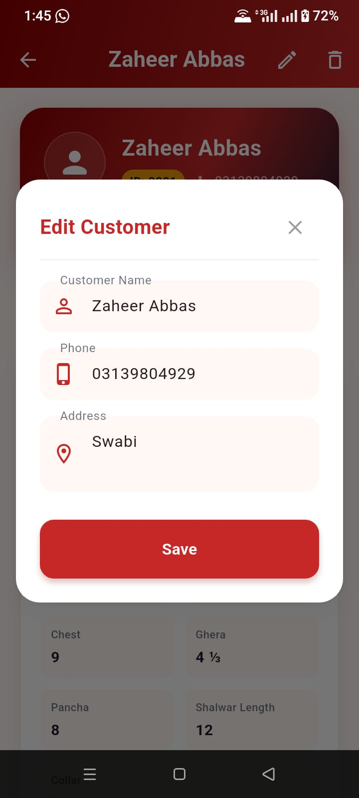

### 📏 Measurements Form
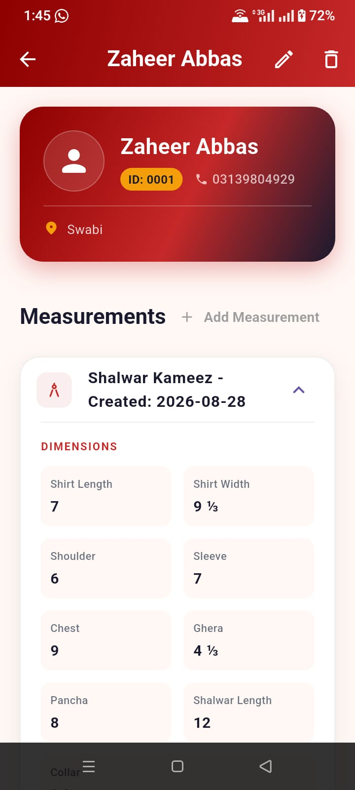

### 🛍️ Orders & Workflows
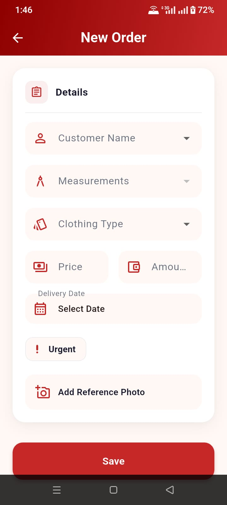
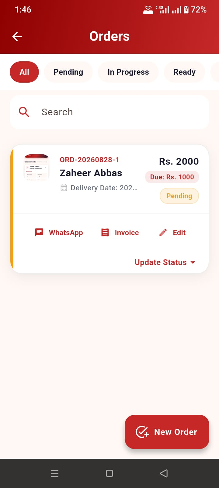


### 💸 Expenses & Business Reports
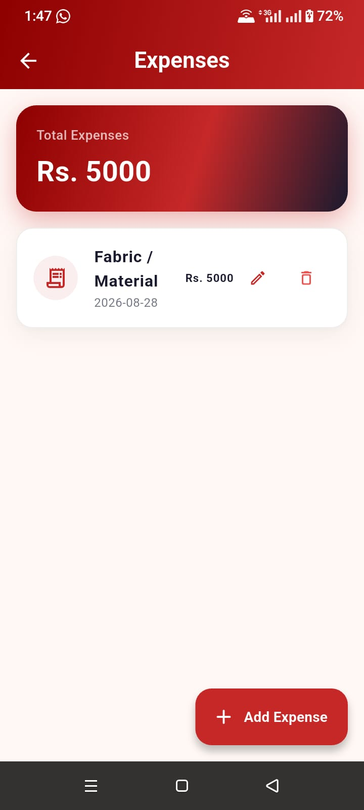
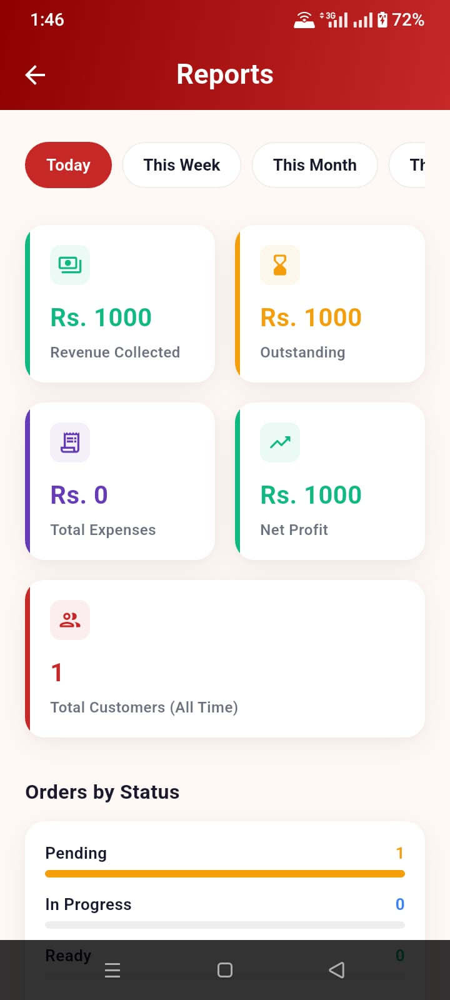

### ⚙️ App Settings & Localization
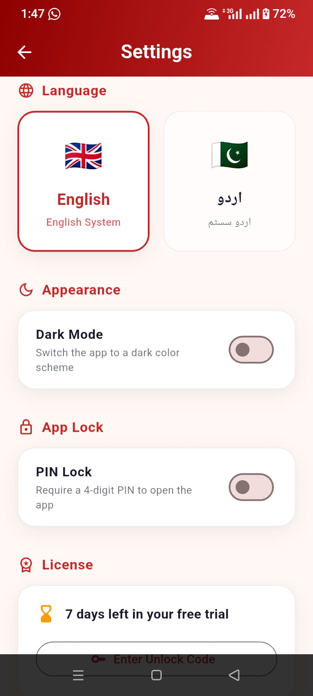
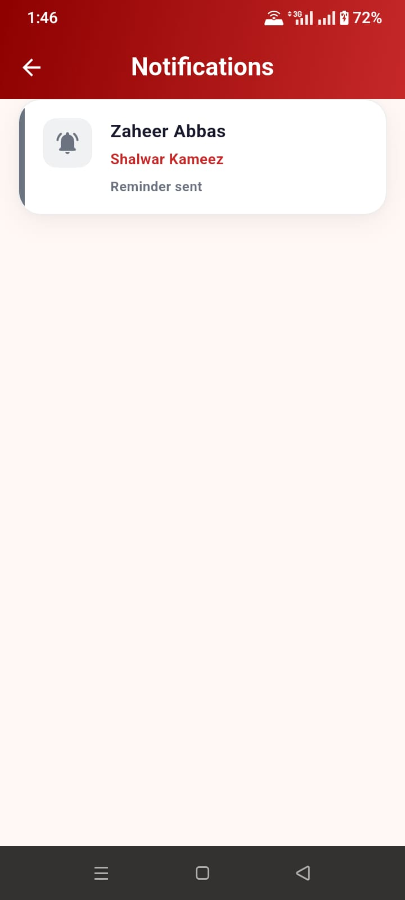
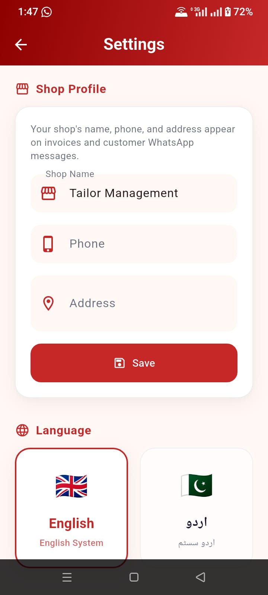
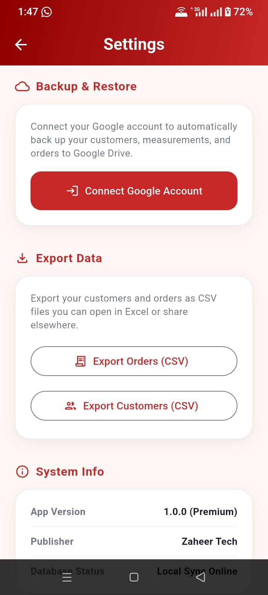

---

## 🌟 Mobile App Key Features

*   **Customers & Measurements**: Store complete customer files with detailed measurements for *Shalwar Kameez*, *Waistcoat*, *Two-Piece*, and *Three-Piece* suits (with historical backup).
    *   *Measurements detail*: shirt length/width, shoulder, sleeve, collar, chest, ghera, pancha, ban/daman/sleeve style, pockets, and finishing details (ring button, double silai, chamak tar), with full historic logs.
*   **Order & Payment Workflows**: Create orders with custom delivery dates, priority status, reference photos, linear status tracking (`Pending` ➔ `In Progress` ➔ `Ready` ➔ `Delivered`), and automatic payment-on-delivery collection prompts.
*   **Bilingual & Adaptive UI**: Full support for English and Urdu with automatic Right-to-Left (RTL) layout switching and an offline theme toggle (Light / Dark Mode).
*   **Google Drive Backups**: Sync offline SQLite databases directly to the shop owner's personal Google Drive folder for safe-keeping.
*   **Security & Licensing**: Keep data safe via a 4-digit PIN stored in encrypted secure storage, and enforce monetization with a 7-day offline trial and device-locked activation codes.
*   **Utility Services**: One-tap WhatsApp notifications, local notifications for delivery reminders (Android only), PDF invoice generation, and CSV data export.

---

## 🛠️ Tech Stack & Dependencies

*   **Framework**: Flutter (Material 3)
*   **Database (Local)**: `sqflite` (Android/iOS) and `sqflite_common_ffi` (Windows/Linux)
*   **State Management**: `provider` for application state (locale, theme, app lock, backup status)
*   **Google Drive API**: `google_sign_in` + `googleapis` (`drive/v3`)
*   **Localization**: `flutter_localizations` (Urdu & English)
*   **Invoicing**: `pdf` + `printing` for PDF generation and native share sheet integration
*   **Local Notifications**: `flutter_local_notifications` + `timezone` for delivery reminders
*   **Storage & Utilities**: `flutter_secure_storage` (PIN encryption), `device_info_plus` + `crypto` (device-specific hashes), `share_plus`, `url_launcher`

---

## 📁 Mobile App Project Structure

```
mobile_app/lib/
  db/            DatabaseHelper — schema definition, versioned migrations, and SQLite connection
  models/        Customer, Measurement, Order, Expense (plain Dart classes with toJson/fromJson/copyWith)
  repositories/  CustomerRepository, MeasurementRepository, OrderRepository, ExpenseRepository — all SQL lives here
  services/      BackupService (Google Drive), InvoiceService (PDF), ExportService (CSV), NotificationService (delivery reminders)
  providers/     LocaleProvider, ThemeProvider, BackupProvider, AppLockProvider (ChangeNotifiers)
  screens/       Dashboard, Customer List/Detail, Measurement Form, Order List/Form, Upcoming Deliveries, Reports, Expense List, Settings, App Lock, Splash
  widgets/       Shared widgets (app drawer, add-customer sheet, expense form sheet)
  utils/         AppColors, FractionHelper, StatusHelper, WhatsappHelper
  l10n/          Generated localization code + app_en.arb / app_ur.arb source strings
```

---

## 🚀 Getting Started

### Prerequisites

To run the Flutter mobile app locally, navigate to the `mobile_app` folder:
```bash
cd mobile_app
flutter pub get
flutter run
```

### Android Build Configurations

*   **NDK Pinning**: `android/app/build.gradle.kts` pins `ndkVersion` to avoid large Gradle NDK downloads. Update the pin to match your local SDK cache if needed.
*   **Desugaring**: Core library desugaring is enabled for older Android API compatibility.
*   **Permissions**: `POST_NOTIFICATIONS` is declared in `AndroidManifest.xml` for runtime delivery reminders (Android 13+).

### Asset & Localization Commands

*   **Regenerate Launcher Icons**:
    ```bash
    dart run flutter_launcher_icons
    ```
*   **Regenerate Localization Files**:
    ```bash
    flutter gen-l10n
    ```

---

## 🤖 Kotlin Migration Specification

For teams looking to port this project from Flutter to a native Android application, **[`kotlin_app_prompt.md`](file:///e:/Zubair%20Tailors/kotlin_app_prompt.md)** provides a complete system architecture mapping:
*   **UI Layout**: Flutter Widgets ➔ Jetpack Compose (Material 3)
*   **Local Persistence**: `sqflite` ➔ Room Database
*   **Local Notifications & Reminders**: `AlarmManager` + `BroadcastReceiver`
*   **Encrypted PIN Storage**: `flutter_secure_storage` ➔ `EncryptedSharedPreferences`

---

## ⚠️ Known Limitations

*   **Order Photos**: Stored locally on the device only; they are not uploaded to Google Drive backups.
*   **Notifications**: Delivery reminder alerts are Android-only.
*   **Timestamps**: Relative backup times (e.g. "5m ago") do not currently localize to Urdu.
*   **Test Coverage**: Standard default Flutter templates are unedited; no custom test coverage exists.
